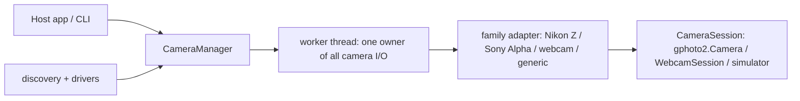

# AbstractCamera

Camera control abstractions for Python and the Abstract* ecosystem: one
thread-safe orchestrator (`CameraManager`) drives any camera family behind a
session protocol — tethered PTP bodies over libgphoto2, the machine's own
cameras (macOS AVFoundation), and a scriptable simulator for camera-less
development and tests. A `CameraHub` pilots several cameras at once (one
worker per camera, hardware-validated with four simultaneously), with
per-device capture folders under `~/Pictures/<device>/`.

## What you get

- A high-level orchestrator: [`CameraManager`](src/abstractcamera/camera_manager.py)
  — live view (latest-JPEG + measured fps), honest config dials backed by a
  write-verification ledger (every write is confirmed or explicitly declared
  reverted), single/burst/movie capture, focus actions, an absolute-deadline
  intervalometer with JSONL manifests, live-view detection
  (lightning/meteor/motion) with auto-fire, a rolling pre-capture buffer, and
  automatic capture downloads.
- Family adapters (hardware-validated): [`adapters/`](src/abstractcamera/adapters/)
  - **Nikon Z** (validated on a Z6 II): exposure-blocking triggers, lazy
    config settling, live-view-gated writes, movie prohibit pre-checks,
    wedge recovery.
  - **Sony Alpha** (validated on an A7R IV): async write settling with
    verify-retry, `[-2]` busy backoff, `prioritymode` gating, press-and-hold
    bursts, silent-AF-refusal detection, fetch-on-announce downloads
    (sdram slot eviction), honest unconfirmable-movie receipts.
  - **Webcam** (validated on a MacBook Pro camera): honest capability
    surface — one real dial (resolution), stills that are video frames and
    say so, genuinely confirmable in-process MP4 recording, detection and
    intervalometer riding the frame stream.
  - **DWARF smart telescope** (network/Wi-Fi, DwarfLab API v2): RTSP live
    view, device-table exposure/gain dials, album-backed captures that
    download over Wi-Fi, and the MOUNT as family actions — GOTO (RA/Dec or
    solar-system), joystick slews, calibration, astro autofocus.
  - **Generic PTP** fallback for unknown tethered bodies.
- Multi-camera piloting: [`hub.py`](src/abstractcamera/hub.py) — a
  `CameraHub` runs one manager/worker per connected camera (concurrent live
  views, sequences and recordings), tracks an ACTIVE selection for
  single-panel hosts, and derives stable device identities (model slug +
  serial disambiguation) that name the per-device capture folders
  `<root>/<device>/[<sequence>/]` with an on-device/local save policy.
- Transport drivers + discovery: [`drivers/`](src/abstractcamera/drivers/),
  [`discovery.py`](src/abstractcamera/discovery.py) — non-invasive
  `list_cameras()` across transports (no device opened, no LED, no
  permission prompt at list time). Webcam identity is the AVFoundation
  uniqueID and capture opens THAT device natively (ADR 0009: names cannot
  point at the wrong camera); Continuity iPhones labeled, never auto-picked.
- A simulator that is a drop-in gphoto2 module:
  [`sim/gphoto2.py`](src/abstractcamera/sim/gphoto2.py) with Nikon Z6 II and
  Sony A7R IV personalities reproducing hardware-measured quirks
  (`ABSTRACTCAMERA_FAKE=1`).
- A CLI for manual checks: `abstractcamera list` / `abstractcamera preview`.

## Install

```bash
pip install abstractcamera                 # webcam + simulator (numpy + OpenCV)
pip install "abstractcamera[gphoto2]"      # + tethered PTP bodies (libgphoto2)
pip install "abstractcamera[clips]"        # + MP4 clip/movie encoding (PyAV)
pip install "abstractcamera[raw]"          # + RAW capture thumbnails (rawpy)
pip install "abstractcamera[dwarf]"        # + DWARF smart telescopes (Wi-Fi)
pip install "abstractcamera[all]"          # everything above
```

## Quickstart

```python
from abstractcamera import CameraManager, list_cameras

for camera in list_cameras():
    print(camera["id"], camera["name"])

manager = CameraManager()
status = manager.connect()            # default: first PTP body, else webcam
manager.set_config_value("iso", "800")   # confirmed/reverted via the ledger
manager.request_trigger()                # capture -> auto-download + catch log
jpeg, seq = manager.get_latest_frame()   # live view
manager.start_interval_sequence(interval_s=5.0, count=10)
manager.disconnect()
```

Camera-less development: set `ABSTRACTCAMERA_FAKE=1` and every transport is
replaced by the simulator (scriptable via `abstractcamera.sim.gphoto2.configure`).

## How it fits together



The manager owns everything family-independent (scheduling windows, the
write ledger, downloads, detection, the watchdog); the adapter owns every
family quirk; the session speaks the pinned wire protocol
([`wire.py`](src/abstractcamera/wire.py), values pinned to libgphoto2).
Architecture decisions live in [docs/adr/](docs/adr/).

## Honesty principles (ADR 0004)

Capabilities never pretend: a webcam exposes no ISO dial instead of a fake
one; Sony movie recording is labeled unconfirmable over USB; every config
write is confirmed against the body or explicitly reported reverted; webcam
names are `reported` from the same device object the session captures from
(ADR 0009 — positional guessing is gone).

## Documentation

- [docs/getting-started.md](docs/getting-started.md)
- [docs/architecture.md](docs/architecture.md)
- [docs/api.md](docs/api.md)
- [docs/faq.md](docs/faq.md) · [docs/troubleshooting.md](docs/troubleshooting.md)
- [docs/adr/](docs/adr/) — architecture decision records
- AI-readable: [llms.txt](llms.txt), [llms-full.txt](llms-full.txt)

## AbstractFramework ecosystem

AbstractCamera is part of the **AbstractFramework** ecosystem
(<https://github.com/lpalbou/AbstractFramework>), alongside AbstractCore,
AbstractVision, AbstractVoice, and friends. It was extracted from the
BlackPixel desktop editor's hardware-validated tethering stack (2026-07-12)
through a 3-agent adversarial design review.

## License

MIT — see [LICENSE](LICENSE).
